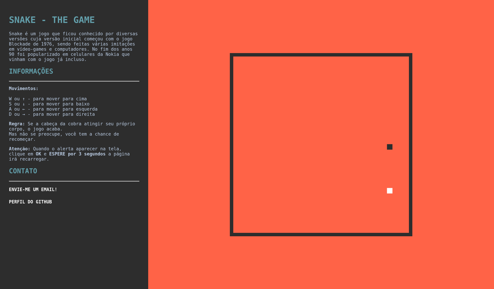

# Snake - The game

Serpente (Snake, também conhecido como "jogo da cobrinha") é um jogo que ficou conhecido por diversas versões cuja versão inicial começou com o jogo Blockade de 1976, sendo feitas várias imitações em vídeo-games e computadores. No fim dos anos 90 foi popularizado em celulares da Nokia que vinham com o jogo já incluso.

### 🗒️ Sobre

O objetivo do projeto foi recriar o jogo da serpente, no qual pratiquei conhecimentos sobre CSS e Javascript, utilizando canvas. A Canvas API provê maneiras de desenhar gráficos via JavaScript e via elemento HTML `<canvas>`. Entre outras coisas, ele pode ser utilizado para animação, gráficos de jogos, visualização de dados, manipulação de fotos e processamento de vídeo em tempo real.. E também utilizando sass que é um dos principais pré-processadores css disponíveis atualmente. 

### 📷 Prévias 

Página principal do jogo

  

### 🔨 Instalação 

1. Abra a pasta do projeto no `VSCode`
2. Instale a extensão `Live Server` e` Live Sass Compiler`
3. Clique com o botão direito em `index.html`>` Open with Live Server`
4. Acesse o ** endereço gerado ** em seu navegador

### 💻 Tecnologias 

 - HTML
 - CSS/SCSS
 - Javascript
 
### 🔗 Referências
Frontend básico - Intermediário 
[Digital Innovation One](https://web.digitalinnovation.one/): Recriando a página inicial do Instagram
